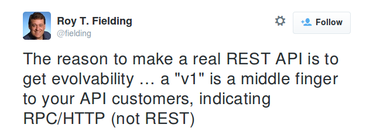

# Verzování

Věčná otázka: Jak verzovat API? Pomocí prefixu v URL? Pomocí HTTP hlaviček? Aby to nebylo jednoduché, já osobně nejsem fanouškem ani jedné z oněch dvou tradičně diskutovaných metod.

## Co je verzování?

1.  Mám existující API a rozhodl jsem se, že jej kompletně přebuduji a představím úplně nové rozhraní, ale pro tentýž účel.

2.  Mám existující API a potřebuji do něj uvést nějakou změnu.

## Přebudováváme celé API

Pro tento případ mám jedinou radu: Jedná se technicky o úplně jiné API a měli byste ho dát na jinou (sub)doménu. Provozujete-li API na adrese `api.example.com`, tak zřiďte např. `api-v2.example.com`. Technicky je to samozřejmě proveditelné přes URL prefixy jako `api.example.com/v2/`, ale v tomto případě takový postup přináší do budoucna jen problémy.

Tvoříte totiž v podstatě úplně novou aplikaci a v kontextu HTTP se nejlépe s aplikacemi pracuje při dodržování pravidla, že jedna (sub)doména představuje jednu samostatnou věc. Třeba ji píšete ve stejném programovacím jazyce a na stejném frameworku, ale do budoucna to nemusí být pravda. Rozhodnete se udělat třetí verzi na bázi [WebSocketů](https://en.wikipedia.org/wiki/WebSocket), napsat ji v [node.js](http://nodejs.org/) nebo budete chtít jen použít jiné HTTPS certifikáty a hned máte velký problém.

## Děláme zpětně nekompatibilní změny

Pokud přidáváme novou funkčnost, většinou se o verzování nezajímáme - prostě ji přidáme a zdokumentujeme. Problém nastává, odebíráme-li funkčnost, nebo pokud děláme změny, jež jsou zpětně nekompatibilní a rozbily by existující klienty.

O čem je vlastně tento typ verzování? Máme nějakou věc - třeba auto. Tu věc můžeme na internetu nějak reprezentovat. Tato reprezentace má nějakou svou adresu, URL. Reprezentace může být v různých formátech - v `text/html` jako webová stránka, v `image/png` jako fotografie nebo třeba v `application/json` jako odpověď v API. Verzování je o tom, že ten formát měníme a potřebujeme ho v čase odlišit. Různé verze jsou tedy jen různými formáty, které jsou si čirou náhodou nějak podobné.

Máme tři možnosti jak verzování řešit:

- Dát verzi do URL,
- dát verzi do HTTP hlaviček,
- vyhýbat se verzování jako čert kříži,

nebo kombinovat výše uvedené.

### URL prefix (např. `api.example.com/v1/...`), parametr (`/resource?v=1`)

Toto je nejoblíbenější řešení v praxi a zřejmě nejzatracovanější mezi odborníky (ne, nemám průzkum, který bych zde citoval a je to jen můj dojem). Problém s touto metodou je hlavně v tom, že jde docela dost proti celé myšlence REST (ačkoli někteří obhájci prefixu by i toto dokázali vyvrátit). Já si myslím, že s touto metodou nemáte moc šancí vytvořit postupně se vyvíjející API - jste svázáni tím, co vám umožní URL a přesměrovávání v rámci HTTP.

Mechanismus URI/URL je určen k identifikaci/adresaci něčeho. Tím jak je lidem na očích ale nejspíš svádí k neustálému "přetěžování" - nalepujeme na něj věci, které do něj nepatří. `/v1` je tudíž asi stejně špatně, jako `/resource?format=xml`. URL je cesta k něčemu, co by klient chtěl a ne popis toho, jak by klient nějakou věc chtěl. Osobně si myslím, že verze do adresy nepatří, jedná se o její mrzačení a nepochopení principů REST.

#### Odkazovatelná URL

Hodně lidí kritizuje řešení HTTP hlavičkami z toho důvodu, že je nelze snadno zanášet do dokumentací nebo vyzkoušet v prohlížeči. Já bych na to asi odpověděl, že by se měl člověk smířit s tím, že HTTP je prostě URL **a** hlavičky **a** tělo zprávy a že je to dost chabý důvod, protože pak stačí jeden `POST` s daty a stejně odkaz udělat nelze.

Každopádně je to ale řešitelný problém - vaše API může fungovat na základě content negotiation a přitom poskytovat speciální parametry v URL, které se do tohoto mechanismu zapojí a vynutí nějakou z možností pro potřeby příkladů nebo ladění. Tyto parametry můžete udělat nejen pro verzi (`?_v=3`), ale i pro formát (`?_format=json` jako suplování `Accept`), jazyk (`?_lang=cs` jako suplování `Accept-Language`) nebo i metodu, budete-li chtít - často se takto implementuje podpora pro `PUT` a `DELETE` do HTML, které má ve formulářích jen `GET` a `POST` (např. `?_method=delete`).

Jak jste si asi na mých příkladech všimli, je dobré tyto speciální parametry nějak odlišit od běžných - třeba podtržítkem. Zabráníte kolizím s běžnými parametry a zároveň dáváte tvůrci klienta signál, že se jedná o něco nestandardního.

#### Obsluhování neexistujících URL

[URL bychom měnit neměli.](http://weblog.jakpsatweb.cz/d/1333060980-tri-zasady-pro-tvorbu-dobrych-seo-url.html) Když už to děláme, měli bychom alespoň ošetřit případy, kdy se někdo na starou adresu odkáže.

Verzujeme-li v URL, nastane okamžik, kdy chceme starou verzi API přestat provozovat nebo kdy např. nechceme některé části nového API implementovat znovu, jelikož se nezměnily, ale nejraději bychom je přesměrovali na existující verzi. K tomu nám poslouží HTTP odpověď `410 Gone` nebo [3xx kódy](https://cs.wikipedia.org/wiki/Stavov%C3%A9_k%C3%B3dy_HTTP#3xx_Redirect).

Pozor na přesměrování - většina klientských knihoven jej implementuje automaticky a tak byste měli přesměrovávat opravdu pouze na zcela ekvivalentní odpovědi. Přesměrování v praxi moc nefunguje jako informace "podobnou věc v nové verzi nalezneš tady", ale spíš "toto je odteď tady", takže nesprávné použití by rozbilo klienty. Raději bych pro nasměrování na novou verzi použil `410 Gone` s tělem, v němž bude ve srozumitelném formátu (máte-li JSON API, tak JSON, ale klidně i HTML) vysvětleno, kam se daná věc poděla a jak nejlépe opravit klienta, aby se ze změny vzpamatoval.

### HTTP hlavičky (např. `application/vnd.company.example-v1+json`)

Tohle dělá např. GitHub ve svém [API](https://developer.github.com/v3/#current-version). V zásadě se jedná o to, že využijete [content negotiation](content-negotiation.md) k tomu, abyste si s klientem domluvili správný formát odpovědi.

Zdokumentujete různé formáty odpovědí na jednotlivé požadavky a přidělíte jim ["vendor" typy](http://tools.ietf.org/html/rfc6838#section-3.2) (hlavička `Content-Type`), jako třeba `application/vnd.github.v2+json` nebo `application/vnd.github.v3+json`. Jeden z těchto formátů budete vracet jako výchozí.

Verzi můžete mimochodem dát také do parametru: `vnd.example-com.foo+json; version=1.0`, což je dle mého názoru hezčí a lépe to ilustruje, že jde jen o jiné stádium vývoje téhož typu.

#### Formát výchozí odpovědi

Pozor! Pokud nechcete při uvední nových verzí API rozbít staré klienty, musíte logicky jako výchozí vracet ten úplně nejstarší typ, se kterým jste API spustili. Jenže klient pak zase bude muset vždy uvést `Accept` hlavičku, což je nepříjemné. Řešením je nejspíš na přechodnou dobu vždy vracet jako výchozí tu původní verzi a po nějaké době a osvětě mezi tvůrci klientů přistoupit k tomu, že stará verze bude už jen na vyžádání hlavičkou, zatímco nová bude nově vždy vrácena jako výchozí.

#### Zpracování požadavku na již nepodporovaný formát

Máte dvě možnosti, jak na serveru zpracovat požadavek s `Accept`, které prosí o vámi nepodporovaný typ. (Schválně jsem použil slovo prosí, jelikož content negotiation v zásadě funguje na principu toho, že server by měl preferenci klienta respektovat, ale vlastně vůbec nemusí.)

1.  Budete hlavičku ignorovat a vrátíte výchozí formát (se správným `Content-Type`, aby klient mohl rozeznat, že nedostal to, co chtěl).
2.  Zamítnete odpověď s HTTP chybou `406 Not Acceptable`, která [znamená](https://cs.wikipedia.org/wiki/Stavov%C3%A9_k%C3%B3dy_HTTP#4xx_Client_Error) "Server může generovat pouze odpověď, která není klientem podporována."

Co použijete je na vás - závisí to od vašeho případu použití, od stavu vašich klientů, apod.

### Třetí "možnost": vůbec neverzovat!

Jak to jednou [Roy Fielding](https://en.wikipedia.org/wiki/Roy_Fielding) [napsal na Twitter](https://twitter.com/fielding/status/376835835670167552):

Tedy něco jako...

> Důvodem proč tvořit opravdová REST API je "evolvability", tedy možnost jejich postupného vývoje. Dát do URL něco jako "v1" je prostředníček uživatelům vašeho API a poukazuje na RPC/HTTP, ne na REST.

### Co je "evolvability"?

Třeba jednou přijdu na to, jak toto slovo přeložit, ale zatím onen čas nepřišel :-) Tím spíše je chybějící překlad bolestivější, když je toto jedna z hlavních výhod [hypermedia API](hypermedia.md). Nejlepší co mě napadlo je asi *rozvíjitelnost*.

Jedná se ve zkratce o to, že API je možné navrhnout tak, aby bylo možné jej v čase vyvíjet a přitom nerozbíjet existující klienty. Trik je především v tom, že klient najde přímo v odpovědi ze serveru instrukce jak se má dále dotazovat, pokud chce udělat to či ono. Sám je potom sestrojen dostatečně volně tak, že dokáže zmíněné instrukce následovat.

Bystrým čtenářům to nejspíš něco připomene - přesně tímto způsobem dnes fungují webové stránky. Také je to HTTP, akorát odpovědi ze serveru jsou ve formátu HTML a klientem je většinou prohlížeč. Zmíněné instrukce jsou pak představovány hlavně odkazy `<a>` a formuláři `<form>`. Klient v odpovědi vyhledá formulář, vyplní jej, odešle na server a je to. Žádná [dokumentace](dokumentace.md), žádné návody.

Řeknete si nejspíš, že za prohlížečem je člověk, ale u API je to program a ten se neumí sám rozhodovat. Ne tak docela - mobilní aplikace může být stejně tak dobře řízena člověkem a pouze mu nabízet možnosti ze serveru, jako to dělá prohlížeč. A pokud jste si někdy napsali scraper, který následoval odkazy nebo odesílal formuláře, nejspíš to ani nevíte a vytvořili jste docela obstojného hypermedia klienta pro API s názvem internet.

REST API **je** webová stránka a webová stránka **je** REST API. Když si vypůjčím slova R. Fieldinga: Kdy naposledy jste viděli číslo verze na webové stránce?

Pro úvod by to nejspíš stačilo - pokud vás tento směr zajímá více, prozkoumejte [tuto část Jak psát API](hypermedia.md).

## Externí zdroje

### [Jeremy H: Versioning and Types in REST/HTTP API Resources](http://thereisnorightway.blogspot.cz/2011/02/versioning-and-types-in-resthttp-api.html)

Jeremy na blogu s příznačným názvem "There Is No Right Way" rozebírá možnosti verzování API, jejich výhody a nevýhody.

### [Roy Fielding: EVOLVE'13 | Keynote](http://www.slideshare.net/evolve_conference/201308-fielding-evolve)

Prezentace R. Fieldinga, na které vysvětluje "evolvability" jako řešení na problém verzování API.

### [Troy Hunt: Your API versioning is wrong, which is why I decided to do it 3 different wrong ways](http://www.troyhunt.com/2014/02/your-api-versioning-is-wrong-which-is.html)

Troy píše, že každá možnost je dobrá pro jiný případ použití. Doporučuje je nakombinovat.

### [Robbie Clutton: API Versioning](http://pivotallabs.com/api-versioning/)

Robbie rozebírá obě možnosti i z pohledu implementace v Ruby. Dochází k závěru, že hlavičky jsou sice fajn, ale z uživatelského hlediska jsou nepraktické, protože na takový požadavek nelze snadno odkázat. Zamýšlí se tedy nad tím, zda by nebylo lepší obě varianty kombinovat.

### [Vinay Sahni: Best Practices for Designing a Pragmatic RESTful API](http://www.vinaysahni.com/best-practices-for-a-pragmatic-restful-api#versioning)

Vinay doporučuje verzování v URL.

### [StackOverflow: Best practices for API versioning?](https://stackoverflow.com/questions/389169/best-practices-for-api-versioning)

Velmi odkazovaná diskuse na StackOverflow, která přesně ilustruje, jak se názory na toto téma mezi lidmi liší :-)

### [Tim Wood: How are REST APIs versioned?](http://www.lexicalscope.com/blog/2012/03/12/how-are-rest-apis-versioned/)

Přehled toho, jak verzování implementují v různých existujících API.

### [Steve Klabnik: Nobody Understands REST or HTTP](http://blog.steveklabnik.com/posts/2011-07-03-nobody-understands-rest-or-http)

Steve vysvětluje, že spousta problémů, které vývojáři řeší, už jsou v HTTP dávno vyřešeny a stačí je použít - psát API, která s HTTP nebojují, ale využívají jej jako stavební kámen. Část tohoto známého článku se zabývá také verzováním.

### [Scott Seely: Versioning REST Services](http://www.informit.com/articles/article.aspx?p=1566460)

Pěkné shrnutí uvedených dvou používaných možností - prefixu v URL a typů v hlavičkách.
